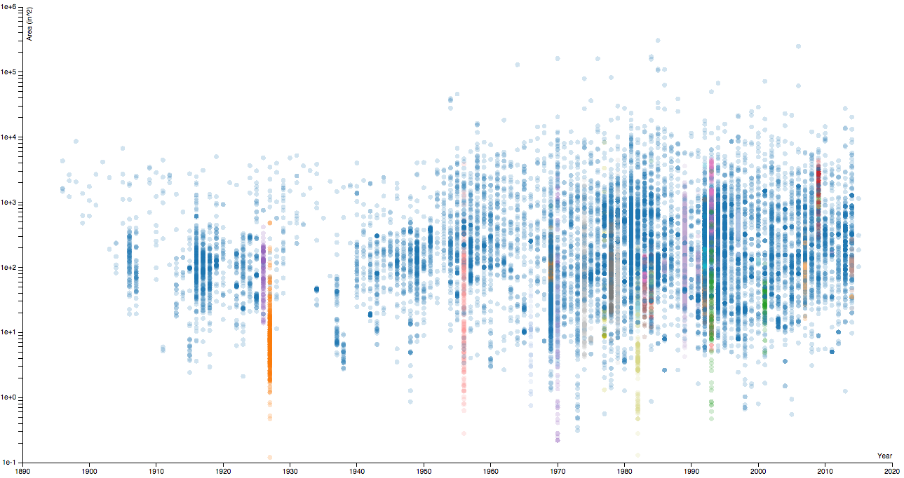
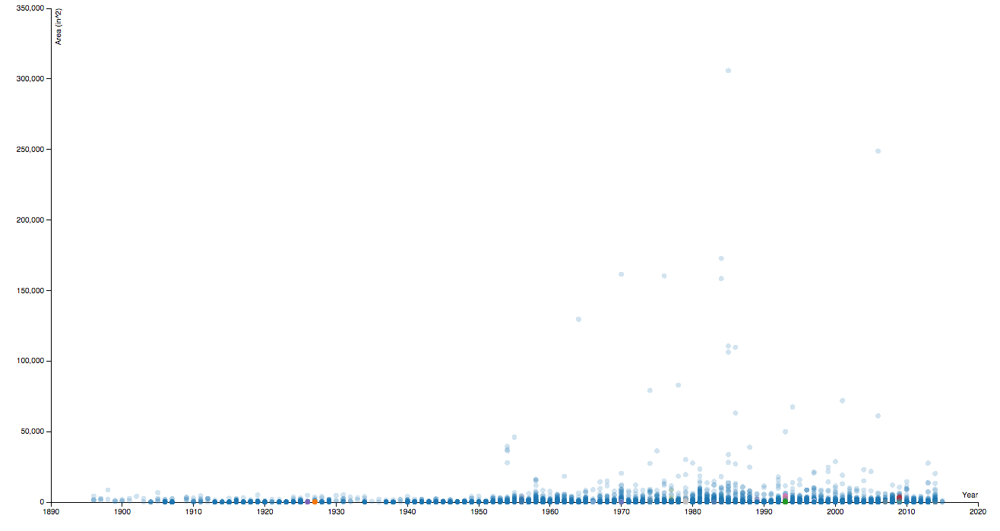

## Data Visualization Workshop

This is a repository of examples used in the Data Visualization workshop.  In it, there are three versions of the same scatterplot.  One of these is done using the [Highcharts](http://www.highcharts.com/) library, one is done using [P5.js](http://p5js.org/), and one is done using [D3](http://d3js.org/).  

The data itself comes from the [Carnegie Museum of Art](http://www.cmoa.org) collection API, which is still in private beta.  We're using it to graph the size of artwork (in square inches) against the year the museum acquired the artwork.  This is useful because it shows changes in the collection choices that the museum has made over the years, and also because it's just a lot of interesting data that I have access to.

We're also going to call out large acquisition lots; collections of artwork obtained at the same time from the same person.  We'll tag those with special colors.

This data set is a .CSV file with ~25,600 records and the following structure:

##### Sample Data

|title            |group  |width |height|area  |creation|acquisition|
|-----------------|------:|-----:|-----:|-----:|-------:|----------:|
|What Steve Saw   |0      |60.250|72.000|4338.0|2010    |2012       |
|The Studio       |0      |25.000|30.750|768.75|1951    |1957       |
|[Untitled]       |0      |5.512 |1.772 |9.77  |1941    |2014       |
|68 Tiges Marteles|0      |23.375|31.500|736.31|1942    |1976       |

The `group` column calls out large collections of items that were acquired at the same time—it's zero unless the group is larger that 100 items, at which point it is the number of items within the group.  Typically, we'd compute this on the fly, but since the API is not yet publicly released, we're going to use this as a placeholder.

Width and height are in inches, area is inches^2.  creation and acquisition are years.

We'll be using the data to generate something that looks like this:

## What are we doing?

This data set is interesting for a couple of reasons.  One is that it's big— there's a lot of data here, so we're going to test performance on this data set.

Another is that we can't directly graph the data, because the variance between the smallest item and the largest item is immense. 

| Wall Drawing #493  |miniature portrait of Louis XVI|
|:------------------:|:-----------------------------:|
| 305,856 in^2       | 0.117 in^2                    |
|   |              |

If we were to plot these with a linear scale for size, you'd get something like this:

In order to display this information usefully, we'll need to use a log scale. This is a standard visualization tool, but it will add enough complexity to our project that we can begin to see the strengths and weaknesses of the various libraries.

---

## Simple HTTP Server

Because we are loading external resources, it's usually easier to serve these files locally.   The easiest way I know of to serve HTML pages is to use to view these files is to use [Python's SimpleHTTPServer](http://www.pythonforbeginners.com/modules-in-python/how-to-use-simplehttpserver/).  To use it, navigate to a directory that you'd like to serve, and type:

`python -m SimpleHTTPServer`

Then open <http://localhost:8000> in any browser.

*if you're using Python 3 and this doesn't work, try* `python3 -m http.server`. 

Mac OSX has python by default — if you're on windows, you can download it [here](https://www.python.org/downloads/windows/).  

## Helpful Links:

### D3:
* **[D3 Website](http://d3js.org/)**
*  **[Scott Murray's Tutorials](http://alignedleft.com/tutorials/d3)** - very helpful tutorial for learning D3.
* **[Interactive Data Visualization for the Web](http://chimera.labs.oreilly.com/books/1230000000345/index.html)** - expanded version of the previous tutorials.
*  **[Mike Bostock's Blocks](http://bl.ocks.org/mbostocks)** - amazing list of d3 examples by the author of D3.

### Highcharts

* **[Highcharts Website](http://www.highcharts.com)**
* **[Highcharts Demos](http://www.highcharts.com/demo)**
* **[Highcharts API Reference](http://www.highcharts.com/demo)**
* **[Highcharts CSV bug](https://github.com/highslide-software/highcharts.com/issues/3850)**

### p5.js

* **[p5.js Website](http://p5js.org)**
* **[p5 Documentation](http://p5js.org/reference/)**
* **[p5 Forum](http://forum.processing.org/two/categories/p5-js)**

### General Data Visualization

* **[Visualizing Data](http://www.visualisingdata.com)** -  a fantastic blog about data visualization. In particular, check out:
* **[The Visualizing Data Resource List](http://www.visualisingdata.com/index.php/resources/)** - A massive list of data visualization tools
* **[The Visualizing Data Dataset List](http://www.visualisingdata.com/index.php/references/)** - *click on 'Data Sources'*.  A list of interesting public data sets.
* **[Flowing Data](http://flowingdata.com)** - another data visualization blog.
* **[Information Aesthetics](http://infosthetics.com)** - Another good blog.
* **[List of other blogs](http://flowingdata.com/2012/04/27/data-and-visualization-blogs-worth-following/)** - Some of these are dead, but it's still with checking out.

### People and Companies
* **[Jer Thorp](http://blog.blprnt.com)** - Data artist.  Worth knowing about.
* **[Nicolas Feltron](http://feltron.tumblr.com)** - Data artist.  Famous for his Annual Reports.
* **[Stamen](http://stamen.com)** - Data visualization company, excellent blog, heavy focus on maps.
* **[Fathom](http://fathom.info/latest/)** - Another interesting data visualization company.

